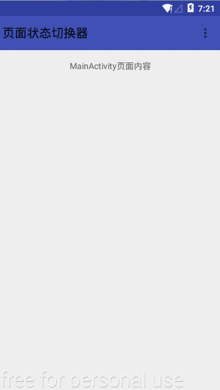
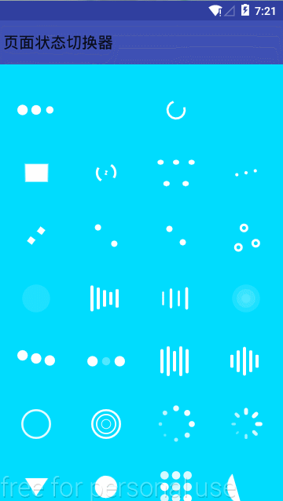

# 页面状态管理器

在我们平时的项目开发当中一般都会有不同的布局View之间的切换，比如：loadingView， contentView， errorView等等
，本项目就是用一个管理类来把这些布局view管理封装起来，使view之间的切换更加简洁方便。首先感谢
[chenpengfei88的statusLayout项目](https://github.com/chenpengfei88/StatusLayout)

<br>

本项目对StatusLayoutManager和StatusLayoutManagerBuild进行了修改和调整，并且把Activity的页面内容
统一抽取出来，产生MyBaseActivity,这样整个项目的所有Activity界面风格能够更方便的趋于统一。

首先来看一下一个普通的Activity如何使用：
```java
public class MainActivity extends MyBaseActivity {

    @Override
    public View initContentView() {
       setReturnStatus(true);
       return  View.inflate(mContext, R.layout.activity_main, null);
    }

    @Override
    public void initData() {

        slManager.showLoading();
        linearLayout_main.postDelayed(new Runnable() {
            @Override
            public void run() {
                slManager.showContent();
            }
        },1000);
    }

    public void retryGetData(){
        super.retryGetData();
        linearLayout_main.postDelayed(new Runnable() {
            @Override
            public void run() {
                slManager.showContent();
            }
        },1000);
    }


    @Override
    public boolean onCreateOptionsMenu(Menu menu) {
        getMenuInflater().inflate(R.menu.toolbar_menu, menu);
        return true;
    }

    @Override
    public boolean onOptionsItemSelected(MenuItem item) {
        switch (item.getItemId()){
            case R.id.action_contents:
                slManager.showContent();
                break;
            case R.id.action_loading:
                slManager.showLoading();
                break;
            case R.id.action_error:
                slManager.showError();
                break;
            case R.id.action_networkError:
                slManager.showNetWorkError();
                break;
            case R.id.action_emptyData:
                slManager.showEmptyData();
                break;
            case R.id.action_startActivity:
                startActivity(new Intent(this,RecyclerViewActivity.class));
                break;
        }
        return super.onOptionsItemSelected(item);
    }
}

```

```xml
<?xml version="1.0" encoding="utf-8"?>
<RelativeLayout xmlns:android="http://schemas.android.com/apk/res/android"
    xmlns:tools="http://schemas.android.com/tools"
    android:layout_width="match_parent"
    android:layout_height="match_parent"
    android:paddingBottom="@dimen/activity_vertical_margin"
    android:paddingLeft="@dimen/activity_horizontal_margin"
    android:paddingRight="@dimen/activity_horizontal_margin"
    android:paddingTop="@dimen/activity_vertical_margin"
    tools:context="com.shi.androidstudy.MainActivity">

    <TextView
        android:layout_width="match_parent"
        android:layout_height="wrap_content"
        android:gravity="center"
        android:text="MainActivity页面内容" />
</RelativeLayout>

```
然后是效果图：

<br>


我们来仔细看一下MyBaseActivity做了哪些事情：

```java

public abstract class MyBaseActivity extends AppCompatActivity {
    /**
     * 当前Activity对象
     **/
    public FragmentActivity mContext = this;
    /**
     * 当前设备宽度
     **/
    public int displayDeviceWidth;
    /**
     * 当前设备高度
     **/
    public int displayDeviceHeight;
    /**
     * 返回键状态标记
     **/
    private boolean returnStatus = false;

    /**
     * 初始化布局文件
     **/
    public abstract View initContentView();

    /**
     * 初始化页面数据
     **/
    public abstract void initData();

    public void retryGetData(){
        slManager.showLoading();
    }


    protected long previewBackTime;

    protected StateLayoutManagerBuilder builder;
    protected LinearLayout linearLayout_main;
    protected StatesLayoutManager slManager;

    @Override
    protected void onCreate(Bundle savedInstanceState) {
        super.onCreate(savedInstanceState);
        setContentView(R.layout.layout_title);
        Toolbar toolbar = (Toolbar) findViewById(R.id.toolbar);
        setSupportActionBar(toolbar);
        linearLayout_main = (LinearLayout) findViewById(R.id.linearLayout_main);
        displayDeviceWidth = getResources().getDisplayMetrics().widthPixels;
        displayDeviceHeight = getResources().getDisplayMetrics().heightPixels;
        builder = new StateLayoutManagerBuilder(this)
                .setContentView(initContentView())
                .setLoadingLayoutResId(R.layout.activity_loading)
                .setContentEmptyLayoutResId(R.layout.activity_emptydata)
                .setContentErrorResId(R.layout.activity_error)
                .setNetWorkErrorLayoutResId(R.layout.activity_networkerror)
                .setRetryViewId(R.id.button_try)
                .setOnRetryListener(new OnRetryListener() {
                    @Override
                    public void onRetry() {
                        retryGetData();
                    }
                });
        slManager = builder.create();
        linearLayout_main.addView(slManager.getRootLayout(),1);
        initData();
    }

    /**
     * 设置返回键状态
     **/
    protected void setReturnStatus(boolean returnStatus) {
        this.returnStatus = returnStatus;
    }


	//关闭当前Activity时
	@Override
	public void onBackPressed() {
		if(returnStatus){
            long currentTime = System.currentTimeMillis();
           if(previewBackTime != 0 && currentTime - previewBackTime < 300){
               finish();
           }else{
               previewBackTime = currentTime;
               Toast.makeText(mContext,"再次返回退出软件",Toast.LENGTH_SHORT).show();
           }
		}else{
			super.onBackPressed();
		}
	}


    public boolean onTouchEvent(MotionEvent event) {
        if (null != this.getCurrentFocus()) {
            InputMethodManager mInputMethodManager = (InputMethodManager) getSystemService(INPUT_METHOD_SERVICE);
            return mInputMethodManager.hideSoftInputFromWindow(this.getCurrentFocus().getWindowToken(), 0);
        }
        return super.onTouchEvent(event);
    }


}
```
代码中主要用到了一个StatesLayoutManager类来管理各种情况的布局View进行切换，而StatesLayoutManager类的产生
用到了builder模式，可以自由的添加你需要的布局View，通过statusLayoutManager.getRootLayout()方法
可以得到管理这些布局View的根布局，然后把它添加到你Activity中xml文件的根布局当中。

StatusLayoutManager提供了一系列的方法来显示不同布局View之间的切换

statusLayoutManager.showLoading(); 显示loading加载view

statusLayoutManager.showContent(); 显示你的内容view

statusLayoutManager.showEmptyData(); 显示空数据view

statusLayoutManager.showError(); 显示error view

statusLayoutManager.showNetWorkError();  显示网络异常view

项目还用到了一个蛮不错的进度条Loading加载开源项目
[项目地址](https://github.com/81813780/AVLoadingIndicatorView)

<br>

<br>

